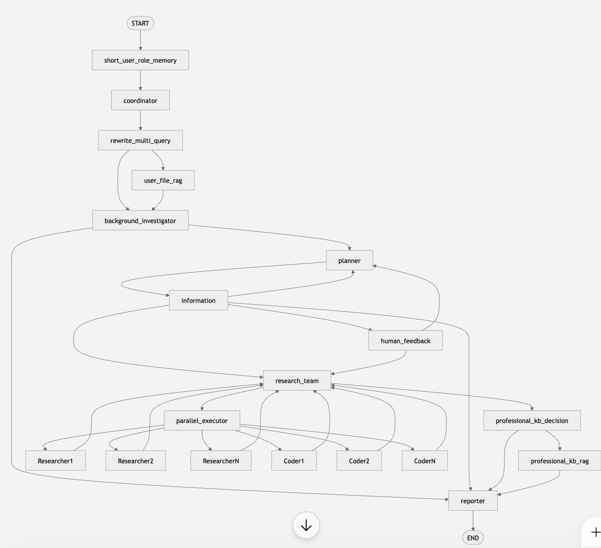
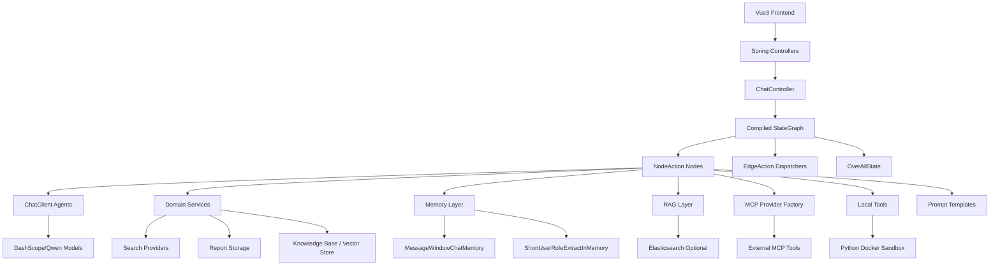
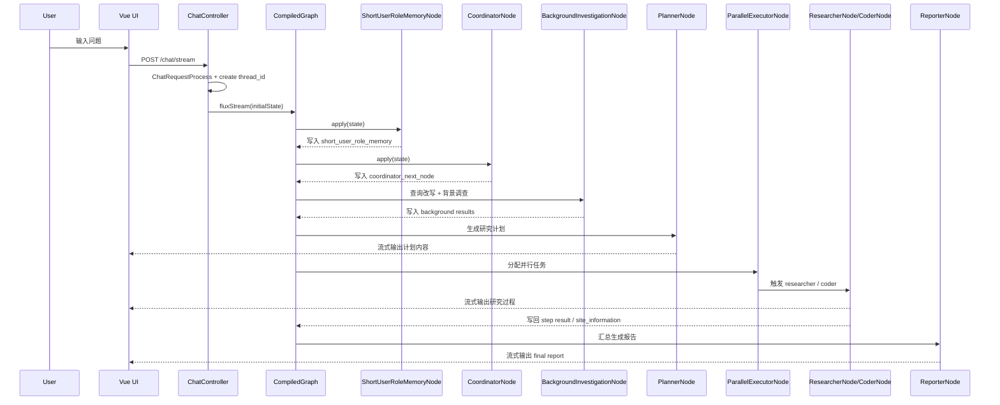
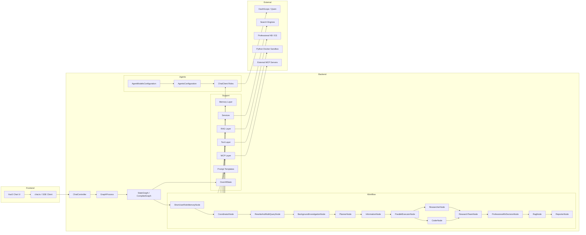

# DeepResearch Agent 项目架构解析

本文不是逐行讲代码语法，而是从架构师视角解释这个项目的目标、模块职责、执行流程、状态流转、Prompt 组织方式，以及它与 LangGraph、CrewAI、OpenAI Agents SDK 的差异。

---

## 第一阶段：项目结构、入口、Agent、Prompt、Tool、Memory 定位

### 1. 项目结构树

已过滤 `node_modules`、`.git`、`target`、`build`、`dist`、`venv` 等目录。

```text
deepresearch/
├── AGENTS.md
├── Architecture.md
├── CLAUDE.md
├── Dockerfile
├── docker-compose.yml
├── docker-compose-middleware.yml
├── pom.xml
├── README.md
├── README_zh.md
├── DeepResearch.http
├── dockerConfig/
│   ├── app-application.yml
│   ├── es.yaml
│   └── redis.conf
├── docs/
│   ├── ARCHITECTURE.md
│   ├── ARCHITECTURE-zh.md
│   ├── FULL_CONFIG.md
│   └── FULL_CONFIG-zh.md
├── imgs/
├── src/
│   ├── main/
│   │   ├── java/com/alibaba/cloud/ai/example/deepresearch/
│   │   │   ├── DeepResearchApplication.java
│   │   │   ├── agents/
│   │   │   │   ├── AgentModelsConfiguration.java
│   │   │   │   ├── AgentsConfiguration.java
│   │   │   │   ├── McpAssignNodeConfiguration.java
│   │   │   │   └── ObservationConfiguration.java
│   │   │   ├── config/
│   │   │   │   ├── DeepResearchConfiguration.java
│   │   │   │   ├── DeepResearchProperties.java
│   │   │   │   ├── HttpClientConfiguration.java
│   │   │   │   ├── MemoryConfig.java
│   │   │   │   ├── RedisConfig.java
│   │   │   │   ├── ReflectionProperties.java
│   │   │   │   ├── ShortTermMemoryProperties.java
│   │   │   │   ├── SmartAgentProperties.java
│   │   │   │   ├── WebConfiguration.java
│   │   │   │   ├── export/
│   │   │   │   └── rag/
│   │   │   ├── controller/
│   │   │   │   ├── ChatController.java
│   │   │   │   ├── McpController.java
│   │   │   │   ├── RagDataController.java
│   │   │   │   ├── RedirectController.java
│   │   │   │   ├── ReportController.java
│   │   │   │   ├── ShortUserRoleMemoryController.java
│   │   │   │   ├── graph/GraphProcess.java
│   │   │   │   └── request/ChatRequestProcess.java
│   │   │   ├── dispatcher/
│   │   │   ├── memory/
│   │   │   ├── model/
│   │   │   ├── node/
│   │   │   │   ├── ShortUserRoleMemoryNode.java
│   │   │   │   ├── CoordinatorNode.java
│   │   │   │   ├── RewriteAndMultiQueryNode.java
│   │   │   │   ├── BackgroundInvestigationNode.java
│   │   │   │   ├── PlannerNode.java
│   │   │   │   ├── InformationNode.java
│   │   │   │   ├── HumanFeedbackNode.java
│   │   │   │   ├── ParallelExecutorNode.java
│   │   │   │   ├── ResearcherNode.java
│   │   │   │   ├── CoderNode.java
│   │   │   │   ├── ResearchTeamNode.java
│   │   │   │   ├── ProfessionalKbDecisionNode.java
│   │   │   │   ├── RagNode.java
│   │   │   │   └── ReporterNode.java
│   │   │   ├── rag/
│   │   │   ├── repository/
│   │   │   ├── serializer/
│   │   │   ├── service/
│   │   │   │   ├── ReportService.java
│   │   │   │   ├── RagNodeService.java
│   │   │   │   ├── McpProviderFactory.java
│   │   │   │   ├── SearchFilterService.java
│   │   │   │   ├── SearchInfoService.java
│   │   │   │   ├── VectorStoreDataIngestionService.java
│   │   │   │   └── multiagent/
│   │   │   ├── tool/
│   │   │   │   ├── PlannerTool.java
│   │   │   │   ├── PythonReplTool.java
│   │   │   │   └── SearchFilterTool.java
│   │   │   └── util/
│   │   └── resources/
│   │       ├── application.yml
│   │       ├── application-observability.yml
│   │       ├── application-kb.yml
│   │       ├── mcp-config.json
│   │       ├── model-config.json
│   │       ├── website-weight-config.json
│   │       ├── prompts/
│   │       │   ├── background.md
│   │       │   ├── backgroundInfoCheck.md
│   │       │   ├── buildInteractiveHtmlPrompt.md
│   │       │   ├── coder.md
│   │       │   ├── coordinator.md
│   │       │   ├── planner.md
│   │       │   ├── rag.md
│   │       │   ├── reflection.md
│   │       │   ├── reporter.md
│   │       │   ├── researcher.md
│   │       │   ├── memory/short/
│   │       │   └── multiagent/
│   │       └── report/
│   └── test/
│       ├── java/com/alibaba/cloud/ai/example/deepresearch/controller/graph/
│       └── java/com/alibaba/cloud/ai/example/deepresearch/tool/
├── tools/
└── ui-vue3/
    ├── package.json
    ├── vite.config.ts
    ├── cypress.config.ts
    ├── src/
    │   ├── main.ts
    │   ├── App.vue
    │   ├── base/
    │   ├── components/
    │   ├── composables/
    │   ├── db/
    │   ├── router/
    │   │   ├── defaultRoutes.ts
    │   │   └── index.ts
    │   ├── services/api/
    │   │   ├── chat.ts
    │   │   ├── config.ts
    │   │   ├── mcp.ts
    │   │   ├── rags.ts
    │   │   └── reports.ts
    │   ├── store/
    │   ├── types/
    │   ├── utils/
    │   └── views/
    │       ├── chat/
    │       ├── config/
    │       ├── knowledge/
    │       ├── login/
    │       └── error/
    └── public/
```

### 2. 程序入口

程序入口分成三个层次。

#### 2.1 后端应用入口

- `src/main/java/com/alibaba/cloud/ai/example/deepresearch/DeepResearchApplication.java`

这是标准 Spring Boot 启动类，负责拉起整个 Java 服务。

#### 2.2 Agent 运行时入口

- `src/main/java/com/alibaba/cloud/ai/example/deepresearch/controller/ChatController.java`

真实的用户请求从这里进入。它做三件事：

1. 规范化 `ChatRequest`
2. 编译并持有 `StateGraph`
3. 调用 `compiledGraph.fluxStream(...)`，开始一次图执行

#### 2.3 前端入口

- `ui-vue3/src/main.ts`
- `ui-vue3/src/services/api/chat.ts`

前端通过 `/chat/stream`、`/chat/resume`、`/chat/stop` 调后端 SSE 接口。

### 3. Agent 定义在哪里

这个项目没有把 Agent 写成“一个 Python 类 + 一组方法”的形式，而是拆成三层。

#### 3.1 Agent 模型定义

- `src/main/resources/model-config.json`
- `src/main/java/com/alibaba/cloud/ai/example/deepresearch/repository/ModelParamRepositoryImpl.java`
- `src/main/java/com/alibaba/cloud/ai/example/deepresearch/agents/AgentModelsConfiguration.java`

`model-config.json` 定义了多个角色对应的模型：

- `research`
- `background`
- `rewriteAndMultiQuery`
- `coder`
- `coordinator`
- `planner`
- `reporter`
- `reflection`
- `rag`
- `shortMemory`
- 以及多个 smart agent

`AgentModelsConfiguration` 在启动时读取这个 JSON，为每个模型动态注册一个 `ChatClient.Builder` Bean，例如：

- `researchChatClientBuilder`
- `plannerChatClientBuilder`
- `coderChatClientBuilder`

#### 3.2 Agent 角色定义

- `src/main/java/com/alibaba/cloud/ai/example/deepresearch/agents/AgentsConfiguration.java`

这里把 `ChatClient.Builder` 进一步装配成角色化的 `ChatClient`：

- `researchAgent`
- `coderAgent`
- `coordinatorAgent`
- `plannerAgent`
- `backgroundAgent`
- `reporterAgent`
- `reflectionAgent`
- `ragAgent`
- `shortMemoryAgent`

#### 3.3 Agent 编排定义

- `src/main/java/com/alibaba/cloud/ai/example/deepresearch/config/DeepResearchConfiguration.java`

这里不是定义“角色”，而是定义“这些 Agent 如何在图里协作”。

这一层是整个项目最关键的总装代码。它做的不是某个单点业务，而是把：

- Agent
- Memory
- RAG
- MCP
- Search
- Reflection
- Report
- Dispatcher

统一装配成一张可运行的 `StateGraph`。

换句话说：

`AgentsConfiguration` 定义的是“每个 Agent 是谁”；

`DeepResearchConfiguration` 定义的是“这些 Agent 以什么顺序、什么条件、共享什么状态协作”。

##### 3.3.1 这个类注入了什么能力

从源码看，`DeepResearchConfiguration` 注入的依赖可以分成 6 组：

1. Agent 角色：
   - `coderAgent`
   - `researchAgent`
   - `reporterAgent`
   - `backgroundAgent`
   - `coordinatorAgent`
   - `plannerAgent`
   - `reflectionAgent`
   - `shortMemoryAgent`
   - `rewriteAndMultiQueryChatClientBuilder`

2. 配置类：
   - `DeepResearchProperties`
   - `ReflectionProperties`
   - `ShortTermMemoryProperties`
   - `RagProperties`
   - `SmartAgentProperties`

3. Memory / 会话上下文：
   - `ShortTermMemoryRepository`
   - `MessageWindowChatMemory`
   - `SessionContextService`

4. 支撑服务：
   - `ReportService`
   - `InfoCheckService`
   - `SearchFilterService`
   - `RagNodeService`

5. 可选智能能力：
   - `QuestionClassifierService`
   - `SearchPlatformSelectionService`
   - `SmartAgentDispatcherService`
   - `ToolCallingSearchService`

6. 外部工具与集成：
   - `McpProviderFactory`
   - `JinaCrawlerService`

这说明图编排层不是“只连节点”，而是一个真正的系统装配层。节点能做什么、能调用什么、能看到什么状态，都是在这里被决定的。

##### 3.3.2 `reflectionProcessor()`：先把可选能力封装成统一组件

源码里先定义了：

```java
@Bean
public ReflectionProcessor reflectionProcessor() {
    if (!reflectionProperties.isEnabled()) {
        return null;
    }
    return new ReflectionProcessor(reflectionAgent, reflectionProperties.getMaxAttempts());
}
```

这里的设计很典型：

- Reflection 是可选能力
- 关闭时直接返回 `null`
- 开启时返回统一的 `ReflectionProcessor`

这样后续 `ResearcherNode`、`CoderNode` 不需要自己判断复杂配置，只需要判断：

- 有没有 `reflectionProcessor`

这是一种很干净的 feature toggle 实现方式。

##### 3.3.3 `deepResearch(...)`：真正构造整张图

核心方法是：

```java
@Bean
public StateGraph deepResearch(ChatClient researchAgent) throws GraphStateException
```

它返回的是一个 Spring Bean：`StateGraph`。

也就是说，这个项目不是每次请求都重新定义流程，而是在启动期就把图结构编译好，运行期只是往图里灌状态并执行。

##### 3.3.4 `KeyStrategyFactory`：先定义状态如何合并

在创建 `StateGraph` 之前，源码先构建了一个 `KeyStrategyFactory`。

这里注册了一批状态键，例如：

- 路由控制键：
  - `short_user_role_next_node`
  - `coordinator_next_node`
  - `rewrite_multi_query_next_node`
  - `background_investigation_next_node`
  - `planner_next_node`
  - `information_next_node`
  - `human_next_node`
  - `research_team_next_node`

- 用户输入键：
  - `query`
  - `thread_id`
  - `enable_deepresearch`
  - `auto_accepted_plan`
  - `max_step_num`
  - `mcp_settings`
  - `session_id`

- 中间结果键：
  - `optimize_queries`
  - `background_investigation_results`
  - `site_information`
  - `current_plan`
  - `planner_content`
  - `observations`
  - `final_report`

- 并行节点输出键：
  - `researcher_content_0..N`
  - `coder_content_0..N`

这些键统一绑定的是：

- `ReplaceStrategy`

这意味着图里的大多数状态采用“后写覆盖前写”的方式。

为什么这里重要？

因为它说明这个系统的本质不是“消息队列式流水账”，而是“显式共享状态对象”。每个节点都在修改同一个全局工作上下文，只是修改不同 key。

##### 3.3.5 节点装配：把业务阶段映射成图节点

随后源码开始通过 `.addNode(...)` 装配图节点：

```java
.addNode("short_user_role_memory", ...)
.addNode("coordinator", ...)
.addNode("rewrite_multi_query", ...)
.addNode("background_investigator", ...)
.addNode("user_file_rag", ...)
.addNode("planner", ...)
.addNode("professional_kb_decision", ...)
.addNode("professional_kb_rag", ...)
.addNode("information", ...)
.addNode("human_feedback", ...)
.addNode("research_team", ...)
.addNode("parallel_executor", ...)
.addNode("reporter", ...)
```

这部分最值得注意的不是“加了多少节点”，而是每个节点的职责边界很清晰：

1. `short_user_role_memory`
   - 负责用户画像短期记忆抽取与更新

2. `coordinator`
   - 负责判断问题是否值得进入深度研究

3. `rewrite_multi_query`
   - 负责把用户原始 query 改写成适合搜索和规划的多个 query

4. `background_investigator`
   - 负责前置背景调查和资料补充

5. `user_file_rag`
   - 负责对用户上传文件做检索增强

6. `planner`
   - 负责生成结构化研究计划

7. `professional_kb_decision`
   - 负责判断是否要走专业知识库

8. `professional_kb_rag`
   - 负责专业知识库检索与增强

9. `information`
   - 负责对规划结果做阶段性判断，决定继续规划、进入人工反馈、进入研究团队，或直接收敛

10. `human_feedback`
    - 负责人类反馈节点

11. `research_team`
    - 负责研究团队阶段的统筹与下一步分发

12. `parallel_executor`
    - 负责触发并行 researcher/coder 执行

13. `reporter`
    - 负责最终报告生成与持久化

这说明这张图的建模方法不是“按技术分层切节点”，而是“按认知工作流切节点”。

##### 3.3.6 节点和依赖是如何绑定的

每个节点在这里都被直接 new 出来，并显式注入所需依赖。

例如：

- `ShortUserRoleMemoryNode(shortMemoryAgent, shortTermMemoryProperties, shortTermMemoryRepository)`
- `CoordinatorNode(coordinatorAgent, sessionContextService, messageWindowChatMemory, shortTermMemoryProperties)`
- `BackgroundInvestigationNode(jinaCrawlerService, infoCheckService, searchFilterService, questionClassifierService, searchPlatformSelectionService, smartAgentProperties, backgroundAgent, sessionContextService, toolCallingSearchService)`
- `ReporterNode(reporterAgent, reportService, sessionContextService, messageWindowChatMemory, shortTermMemoryProperties)`

这种写法虽然比“组件自动扫描”更显式，但优势很大：

1. 看配置类就能知道每个节点依赖什么
2. 节点职责边界一目了然
3. 图的装配关系集中在一个地方，便于全局理解

对于架构阅读来说，这是一种非常友好的实现。

##### 3.3.7 `configureParallelNodes(...)`：并行节点是动态生成的

这部分源码是项目里非常典型的“图协作增强点”。

源码没有手写固定的：

- `researcher_0`
- `researcher_1`
- `coder_0`
- `coder_1`

而是根据配置动态生成：

```java
for (int i = 0; i < deepResearchProperties.getParallelNodeCount().get(ParallelEnum.RESEARCHER.getValue()); i++) {
    String nodeId = "researcher_" + i;
    stateGraph.addNode(nodeId, ...);
    stateGraph.addEdge("parallel_executor", nodeId).addEdge(nodeId, "research_team");
}
```

`coder` 节点也是同样模式。

这说明：

1. 并行度是配置驱动的
2. 图结构不是完全静态文本，而是启动时按配置生成
3. `parallel_executor` 不是执行任务本身，而是一个“并行阶段入口”

也就是说，这个系统的图并不是简单 DAG，而是“带参数化并行扇出”的可配置图。

##### 3.3.8 条件边：图协作方式的核心

图协作真正发生在条件边部分：

```java
stateGraph.addEdge(START, "short_user_role_memory")
    .addConditionalEdges("short_user_role_memory", ...)
    .addConditionalEdges("coordinator", ...)
    .addConditionalEdges("rewrite_multi_query", ...)
    .addConditionalEdges("background_investigator", ...)
    .addEdge("user_file_rag", "background_investigator")
    .addEdge("planner", "information")
    .addConditionalEdges("information", ...)
    .addConditionalEdges("human_feedback", ...)
    .addConditionalEdges("research_team", ...)
    .addConditionalEdges("professional_kb_decision", ...)
    .addEdge("professional_kb_rag", "reporter")
    .addEdge("reporter", END);
```

这段代码可以拆成三个层面理解。

###### A. 主干链路

主干链路是：

`START -> short_user_role_memory -> coordinator -> rewrite_multi_query -> background_investigator -> planner -> information`

这是标准深度研究的前半段。

###### B. 分支链路

在若干关键节点会发生条件分支：

- `short_user_role_memory`
  - 通常进入 `coordinator`
  - 异常时可直接结束

- `coordinator`
  - 进入 `rewrite_multi_query`
  - 或直接 `END`

- `rewrite_multi_query`
  - 进入 `background_investigator`
  - 或先走 `user_file_rag`
  - 或 `END`

- `background_investigator`
  - 进入 `planner`
  - 或直接 `reporter`
  - 或 `END`

- `information`
  - 进入 `reporter`
  - 或 `human_feedback`
  - 或回到 `planner`
  - 或进入 `research_team`
  - 或 `END`

- `research_team`
  - 进入 `parallel_executor`
  - 或进入 `professional_kb_decision`
  - 或 `END`

- `professional_kb_decision`
  - 进入 `professional_kb_rag`
  - 或直接 `reporter`
  - 或 `END`

###### C. 回环与迭代

这里不是纯单向直线图，因为存在回环：

- `planner -> information -> planner`
- `human_feedback -> planner`
- `parallel researcher/coder -> research_team`

这意味着系统支持：

1. 计划多轮迭代
2. HITL 反馈后重规划
3. 并行子任务收敛后再继续后续判断

###### D. 严格对应源码顺序的 Mermaid 工作流图

下面这张图严格按照 `DeepResearchConfiguration.java` 中链式调用的书写顺序展开，尽量做到：

- 每一条 `addEdge(...)` 都有显式连线
- 每一组 `addConditionalEdges(...)` 都有逐条条件边
- 并行 `researcher_N` / `coder_N` 的扇出和回收也标出来

```mermaid


flowchart TD
    START([START])
    ENDNODE([END])

    SUM[short_user_role_memory]
    COORD[coordinator]
    REWRITE[rewrite_multi_query]
    BGI[background_investigator]
    USER_RAG[user_file_rag]
    PLAN[planner]
    INFO[information]
    HF[human_feedback]
    TEAM[research_team]
    PAR[parallel_executor]
    PKD[professional_kb_decision]
    PKR[professional_kb_rag]
    REPORT[reporter]

    R0[researcher_0]
    R1[researcher_1]
    R2[researcher_2]
    R3[researcher_3]
    C0[coder_0]
    C1[coder_1]
    C2[coder_2]
    C3[coder_3]

    START -->|addEdge| SUM

    SUM -->|addConditionalEdges: coordinator| COORD
    SUM -->|addConditionalEdges: END| ENDNODE

    COORD -->|addConditionalEdges: rewrite_multi_query| REWRITE
    COORD -->|addConditionalEdges: END| ENDNODE

    REWRITE -->|addConditionalEdges: background_investigator| BGI
    REWRITE -->|addConditionalEdges: user_file_rag| USER_RAG
    REWRITE -->|addConditionalEdges: END| ENDNODE

    USER_RAG -->|addEdge| BGI

    BGI -->|addConditionalEdges: reporter| REPORT
    BGI -->|addConditionalEdges: planner| PLAN
    BGI -->|addConditionalEdges: END| ENDNODE

    PLAN -->|addEdge| INFO

    INFO -->|addConditionalEdges: reporter| REPORT
    INFO -->|addConditionalEdges: human_feedback| HF
    INFO -->|addConditionalEdges: planner| PLAN
    INFO -->|addConditionalEdges: research_team| TEAM
    INFO -->|addConditionalEdges: END| ENDNODE

    HF -->|addConditionalEdges: planner| PLAN
    HF -->|addConditionalEdges: research_team| TEAM
    HF -->|addConditionalEdges: END| ENDNODE

    TEAM -->|addConditionalEdges: professional_kb_decision| PKD
    TEAM -->|addConditionalEdges: parallel_executor| PAR
    TEAM -->|addConditionalEdges: END| ENDNODE

    PAR -->|addEdge| R0
    PAR -->|addEdge| R1
    PAR -->|addEdge| R2
    PAR -->|addEdge| R3
    PAR -->|addEdge| C0
    PAR -->|addEdge| C1
    PAR -->|addEdge| C2
    PAR -->|addEdge| C3

    R0 -->|addEdge| TEAM
    R1 -->|addEdge| TEAM
    R2 -->|addEdge| TEAM
    R3 -->|addEdge| TEAM
    C0 -->|addEdge| TEAM
    C1 -->|addEdge| TEAM
    C2 -->|addEdge| TEAM
    C3 -->|addEdge| TEAM

    PKD -->|addConditionalEdges: professional_kb_rag| PKR
    PKD -->|addConditionalEdges: reporter| REPORT
    PKD -->|addConditionalEdges: END| ENDNODE

    PKR -->|addEdge| REPORT
    REPORT -->|addEdge| ENDNODE
```

这张图和源码的对应关系如下：

1. `START -> short_user_role_memory`
   - 对应 `stateGraph.addEdge(START, "short_user_role_memory")`

2. `short_user_role_memory -> coordinator | END`
   - 对应 `addConditionalEdges("short_user_role_memory", ...)`

3. `coordinator -> rewrite_multi_query | END`
   - 对应 `addConditionalEdges("coordinator", ...)`

4. `rewrite_multi_query -> background_investigator | user_file_rag | END`
   - 对应 `addConditionalEdges("rewrite_multi_query", ...)`

5. `user_file_rag -> background_investigator`
   - 对应 `addEdge("user_file_rag", "background_investigator")`

6. `background_investigator -> reporter | planner | END`
   - 对应 `addConditionalEdges("background_investigator", ...)`

7. `planner -> information`
   - 对应 `addEdge("planner", "information")`

8. `information -> reporter | human_feedback | planner | research_team | END`
   - 对应 `addConditionalEdges("information", ...)`

9. `human_feedback -> planner | research_team | END`
   - 对应 `addConditionalEdges("human_feedback", ...)`

10. `research_team -> professional_kb_decision | parallel_executor | END`
    - 对应 `addConditionalEdges("research_team", ...)`

11. `parallel_executor -> researcher_i / coder_i`
    - 对应 `configureParallelNodes(...)` 里对 `researcher_i` / `coder_i` 的 `addEdge`

12. `researcher_i / coder_i -> research_team`
    - 对应 `addResearcherNodes(...)`、`addCoderNodes(...)` 里的回收边

13. `professional_kb_decision -> professional_kb_rag | reporter | END`
    - 对应 `addConditionalEdges("professional_kb_decision", ...)`

14. `professional_kb_rag -> reporter -> END`
    - 对应最后两条 `addEdge`

这里还要注意一个细节：

虽然 Mermaid 图把 `researcher_0..3`、`coder_0..3` 画成了 4 个节点，但这不是硬编码业务规则，而是当前默认配置下 `parallel-node-count` 的一种实例化结果。源码本身是按配置动态生成这些节点的。

##### 3.3.9 图协作方式总结：本质是“中心状态机 + 多角色执行器”

从 `DeepResearchConfiguration.java` 的实现看，这个项目中的 Agent 协作不是自由对话式协作，而是：

**由一张中心图统一调度多个角色 Agent，所有角色共享同一个 `OverAllState`，通过节点产出和条件边切换来协作。**

具体来说：

1. `CoordinatorAgent` 决定是否值得深挖
2. `BackgroundAgent` 提供规划前情报
3. `PlannerAgent` 负责任务拆解
4. `ResearcherAgent` 负责研究型步骤
5. `CoderAgent` 负责处理型/代码型步骤
6. `ReflectionAgent` 在需要时做质量反思
7. `RagAgent` 在需要时融合检索知识
8. `ReporterAgent` 负责输出最终报告

它们不是彼此直接互相发送消息，而是：

- 通过状态共享协作
- 通过 Dispatcher 路由协作
- 通过并行节点扇出/回收协作

这是一个非常强的工程化信号：

系统追求的是“可控协作”，不是“开放自治”。

##### 3.3.10 代码层面的详细解释：为什么这样写

从架构实现角度，这段源码有几个非常值得学习的点。

###### A. 图结构集中定义

所有节点、边、并行块、状态键策略都集中在一个配置类里。

好处：

- 系统可读性强
- 全局拓扑一眼能看出来
- 改流程时不需要跨多个模块来回跳

###### B. 状态键显式注册

很多 Agent 项目状态是隐式扩散的，后期很难治理。

这里通过 `KeyStrategyFactory` 把关键状态键显式列出来，说明作者已经意识到：

- 状态 schema 就是系统契约

###### C. 并行节点配置化

并行 researcher/coder 不是写死，而是由 `parallel-node-count` 驱动。

这让系统可以在：

- 单机调试
- 压测
- 生产部署

之间灵活调并行度，而不用改业务代码。

###### D. 可选能力通过 `@Autowired(required = false)` 接入

例如：

- `MessageWindowChatMemory`
- `JinaCrawlerService`
- `McpProviderFactory`
- `ToolCallingSearchService`
- `QuestionClassifierService`
- `SearchPlatformSelectionService`
- `SmartAgentDispatcherService`

这是典型的“能力开关式装配”。

好处是：

- 不开某个功能时，主流程依然可以运行
- 同一个流程骨架可以适配多种部署形态

###### E. 节点创建时注入依赖，而不是节点自己去查 Bean

这让节点更像纯执行单元，依赖更透明，测试也更容易做。

##### 3.3.11 可以把这段源码理解成什么

如果用更抽象的话来说，`DeepResearchConfiguration.java` 做的是：

1. 定义系统状态空间
2. 定义认知工作流阶段
3. 定义阶段之间的转换条件
4. 定义并行执行策略
5. 定义可选能力如何嵌入主流程

所以它既是：

- 工作流定义文件

也是：

- Agent 协作编排器

还是：

- 系统能力装配中心

对于整个项目来说，这个文件就是后端 Agent Runtime 的“总蓝图”。

### 4. Prompt 定义在哪里

Prompt 主要在 `src/main/resources/prompts/` 下，按职责分层：

#### 4.1 通用角色 Prompt

- `coordinator.md`
- `planner.md`
- `researcher.md`
- `coder.md`
- `background.md`
- `reporter.md`
- `rag.md`
- `reflection.md`

#### 4.2 Memory Prompt

- `memory/short/shortmemory-extract.md`
- `memory/short/shortmemory-update.md`

#### 4.3 Multi-Agent Prompt

- `multiagent/classifier.md`
- `multiagent/search-platform-selector.md`
- `multiagent/academic-researcher.md`
- `multiagent/lifestyle-travel.md`
- `multiagent/encyclopedia.md`
- `multiagent/data-analysis.md`

#### 4.4 Prompt 加载器

- `src/main/java/com/alibaba/cloud/ai/example/deepresearch/util/TemplateUtil.java`
- `src/main/java/com/alibaba/cloud/ai/example/deepresearch/util/multiagent/AgentPromptTemplateUtil.java`

`TemplateUtil` 负责：

- 从 `prompts/*.md` 读取系统提示词
- 替换 `{{ CURRENT_TIME }}`、`{{ max_step_num }}` 等变量
- 把短期记忆注入为额外 `SystemMessage`

所以这个项目的 Prompt 组织方式是：

`静态 Prompt 模板 + 运行时状态注入 + 历史消息拼接 + 特定节点附加说明`

### 5. Tool 定义在哪里

#### 5.1 本地 Tool

在 `src/main/java/com/alibaba/cloud/ai/example/deepresearch/tool/`：

- `PlannerTool.java`
- `PythonReplTool.java`
- `SearchFilterTool.java`

其中：

- `PlannerTool` 用 `@Tool(name = "handoff_to_planner")` 定义了一个“触发规划”的信号型工具
- `PythonReplTool` 用 `@Tool` 暴露 Python 代码执行能力，底层通过 Docker 沙箱运行
- `SearchFilterTool` 用 `@Tool` 暴露搜索和结果过滤能力

#### 5.2 Tool 注册位置

- `AgentsConfiguration.java`

典型注册方式：

- `coordinatorAgent.defaultTools(plannerTool)`
- `coderAgent.defaultTools(new PythonReplTool(coderProperties))`
- `researchAgent.defaultToolNames(...)`

#### 5.3 MCP Tool

- `McpProviderFactory.java`
- `util/mcp/McpClientUtil.java`

MCP Tool 不是启动时全部静态注入，而是运行时根据 `state` 和 `mcp_settings` 动态构造 `AsyncMcpToolCallbackProvider`，再在 `ResearcherNode` / `CoderNode` 调模型前挂进去。

### 6. Memory 定义在哪里

Memory 也分两层。

#### 6.1 会话窗口记忆

- `config/MemoryConfig.java`

使用：

- `MessageWindowChatMemory`
- `InMemoryChatMemoryRepository`

它保存用户与 assistant 的对话窗口，主要给 `CoordinatorNode`、`ReporterNode` 这类需要连续上下文的节点使用。

#### 6.2 用户角色短期记忆

- `memory/ShortTermMemoryRepository.java`
- `memory/ShortUserRoleExtractInMemory.java`
- `node/ShortUserRoleMemoryNode.java`
- `config/ShortTermMemoryProperties.java`

这是本项目一个比较有特色的 Memory 设计：

- 不只是存聊天记录
- 而是单独抽取“用户角色 / 用户概况 / 偏好 / 交互轨迹”
- 然后在后续 Prompt 中以 `SystemMessage` 注入给其他 Agent

---

## 第二阶段：模块职责、依赖关系与架构图

### 1. 整体目标

这是一个面向复杂研究任务的 Deep Research Agent 平台。

它的目标不是单轮问答，而是把用户问题拆成一个可执行研究流程：

1. 判断是否需要深度研究
2. 改写查询并做背景调查
3. 生成研究计划
4. 并行分发给 Researcher 和 Coder
5. 允许 Human-in-the-Loop 中断和反馈
6. 汇总结果并生成最终报告
7. 可选接入 RAG、MCP、Redis、Elasticsearch、Reflection、自定义 Smart Agent

一句话总结：

这是一个“图驱动 + 多角色 Agent + 流式执行 + 状态共享 + 可插拔工具/知识库”的研究型 Agent 系统。

### 2. 核心技术栈

#### 2.1 后端

- Java 17
- Spring Boot 3.4.8
- Spring AI 1.0.0
- Spring AI Alibaba 1.0.0.4
- Spring AI Alibaba Graph
- Reactor Flux / SSE
- Jackson
- Docker Java Client

#### 2.2 模型层

- DashScope / Qwen 系列模型
- 每个 Agent 角色可绑定不同模型

#### 2.3 检索与工具

- Tavily
- Baidu Search
- SerpAPI
- Aliyun AI Search
- Jina Crawler
- MCP Tool Callback
- Python 沙箱执行

#### 2.4 数据与记忆

- InMemory Chat Memory
- 自定义短期记忆仓库
- 可选 Redis
- 可选 Elasticsearch RAG

#### 2.5 前端

- Vue 3
- TypeScript
- Vite
- Pinia
- Ant Design Vue

### 3. Agent Framework 识别

这个项目的核心 Agent Framework 不是 LangGraph、AutoGen、CrewAI，也不是 OpenAI Agents SDK。

它使用的是：

- `com.alibaba.cloud.ai.graph.StateGraph`
- `CompiledGraph`
- `NodeAction`
- `EdgeAction`

也就是：

**Spring AI Alibaba Graph**

可以把它理解为 Java / Spring 生态中的“LangGraph 风格图编排框架”。

#### 它的运行模型

- `NodeAction` 对应图节点
- `EdgeAction` 对应条件路由
- `OverAllState` 对应共享状态
- `StateGraph` 对应整个工作流
- `CompiledGraph` 对应可运行图实例

这决定了项目整体是“状态机 + 图编排 + 角色化 ChatClient”的架构，而不是“多个 autonomous agents 自由对话”的架构。

### 4. 各模块职责

#### 4.1 `controller/`

职责：所有外部入口。

- `ChatController`：主聊天入口、恢复执行、停止执行
- `ReportController`：报告查询、导出、HTML 构建
- `RagDataController`：文件上传、知识库导入
- `McpController`：MCP 服务暴露
- `ShortUserRoleMemoryController`：短期记忆查询与管理

#### 4.2 `agents/`

职责：Agent Bean 装配层。

- 从模型配置加载 `ChatClient.Builder`
- 为每个角色设置默认 Prompt / Tool / MCP 回调
- 输出最终可供节点调用的 `ChatClient`

#### 4.3 `config/`

职责：系统总装层。

- 读取配置
- 初始化 Memory / HTTP / Redis / RAG
- 构造 `StateGraph`
- 挂接节点与边
- 初始化并行 researcher/coder 节点

#### 4.4 `node/`

职责：图上的业务节点。

代表一个执行阶段，而不是一个简单函数。

关键节点：

- `ShortUserRoleMemoryNode`：抽取短期记忆
- `CoordinatorNode`：判断是否进入深度研究
- `RewriteAndMultiQueryNode`：改写查询
- `BackgroundInvestigationNode`：背景调查
- `PlannerNode`：生成计划
- `InformationNode`：评估是否继续规划、人工反馈、并行执行或直接输出
- `ParallelExecutorNode`：触发并行执行
- `ResearcherNode`：研究型子任务执行
- `CoderNode`：代码型子任务执行
- `ResearchTeamNode`：研究团队汇总 / 下一步路由
- `ProfessionalKbDecisionNode`：判断是否走专业知识库
- `RagNode`：执行 RAG
- `ReporterNode`：生成最终报告

#### 4.5 `dispatcher/`

职责：图上的条件边判断。

节点负责写：

- `coordinator_next_node`
- `information_next_node`
- `research_team_next_node`

Dispatcher 负责读这些键并决定跳到哪条边。

这是一种典型的：

**节点产出决策结果，边负责路由控制**

#### 4.6 `service/`

职责：节点背后的服务支撑。

- `RagNodeService`：创建 RAG 节点
- `SearchFilterService` / `SearchInfoService`：搜索与过滤
- `McpProviderFactory`：按状态创建 MCP provider
- `ReportService`：报告持久化/读取
- `VectorStoreDataIngestionService`：文件向量化导入
- `multiagent/*`：智能 Agent 分类、搜索平台选择、调度

#### 4.7 `memory/`

职责：抽象和保存短期用户角色记忆。

#### 4.8 `rag/`

职责：混合检索与知识库接入。

包括：

- 检索策略
- 融合策略
- HyDE 查询改写
- 专业知识库 API / ES

#### 4.9 `tool/`

职责：向模型暴露可调用能力。

#### 4.10 `util/`

职责：模板、状态、反思、转换、MCP、Multi-Agent 工具类。

### 5. 模块依赖关系

高层依赖关系如下：

1. `controller` 依赖 `config` 暴露的 `StateGraph` 和相关 `service`
2. `config` 依赖 `agents`、`node`、`dispatcher`、`service`、`memory`
3. `node` 依赖 `ChatClient`、`service`、`util`、`memory`
4. `dispatcher` 只依赖 `OverAllState`
5. `agents` 依赖 `repository`、`prompt`、`tool`
6. `rag` / `memory` / `tool` 为基础能力层

### 6. Mermaid 模块关系图



---

## 第三阶段：从真实请求追踪调用链、函数顺序、状态变化、Prompt 变化

### 1. 从真实请求开始：用户请求从哪里进入

真实链路如下。

#### 前端入口

- `ui-vue3/src/services/api/chat.ts`
  - `sendChatStream()`
  - `sendResumeStream()`
  - `stopChat()`

#### 后端入口

- `POST /chat/stream`
- `POST /chat/resume`
- `POST /chat/stop`

其中主入口是：

- `ChatController.chatStream()`

### 2. 主调用链

一次标准深度研究请求的大致调用链如下：

```text
UI Chat Page
  -> ChatService.sendChatStream()
  -> POST /chat/stream
  -> ChatController.chatStream()
  -> ChatRequestProcess.getDefaultChatRequest()
  -> SearchBeanUtil.getSearchService()
  -> GraphProcess.createNewGraphId()
  -> ChatRequestProcess.initializeObjectMap()
  -> CompiledGraph.fluxStream(objectMap, runnableConfig)
  -> StateGraph 开始执行
     -> ShortUserRoleMemoryNode.apply()
     -> ShortUserRoleMemoryDispatcher.apply()
     -> CoordinatorNode.apply()
     -> CoordinatorDispatcher.apply()
     -> RewriteAndMultiQueryNode.apply()
     -> RewriteAndMultiQueryDispatcher.apply()
     -> BackgroundInvestigationNode.apply()
     -> BackgroundInvestigationDispatcher.apply()
     -> PlannerNode.apply()
     -> InformationNode.apply()
     -> InformationDispatcher.apply()
     -> ParallelExecutorNode.apply()
     -> ResearcherNode.apply() / CoderNode.apply()
     -> ResearchTeamNode.apply()
     -> ProfessionalKbDecisionNode.apply()
     -> RagNode.apply() 可选
     -> ReporterNode.apply()
  -> GraphProcess.processStream()
  -> SSE chunks 返回前端
```

### 3. 核心流程解释

#### 3.1 用户请求从哪里进入

进入点是：

- 前端：`ChatService.sendChatStream()`
- 后端：`ChatController.chatStream()`

控制器做的事情很关键：

1. 标准化请求参数
2. 校验搜索引擎可用性
3. 生成 `thread_id`
4. 把输入写入初始 `objectMap`
5. 把请求交给 `CompiledGraph`

这里已经体现出设计思想：

**Controller 不处理业务，只负责把 HTTP 请求转成图输入。**

#### 3.2 Agent 如何规划任务

规划并不是在入口直接做，而是经历多层前置步骤：

1. `CoordinatorNode` 判断是否真的需要深度研究
2. `RewriteAndMultiQueryNode` 改写 query
3. `BackgroundInvestigationNode` 收集背景资料
4. `PlannerNode` 基于：
   - 用户问题
   - 优化查询
   - 背景调查结果
   - 用户反馈
   - RAG 内容
   生成 `Plan`

`PlannerNode` 使用：

- `TemplateUtil.getMessage("planner", state)`
- `TemplateUtil.getOptQueryMessage(state)`
- `BeanOutputConverter<Plan>`

所以计划生成不是自由文本，而是：

**Prompt 约束 + 结构化输出解析 + 流式回传**

#### 3.3 Tool 如何注册

Tool 分三类。

##### A. 静态本地 Tool

在 `AgentsConfiguration` 中绑定：

- `coordinatorAgent.defaultTools(plannerTool)`
- `coderAgent.defaultTools(new PythonReplTool(...))`

##### B. 名称式 Tool

例如 `researchAgent` 通过 `defaultToolNames(...)` 绑定搜索/爬虫类工具。

##### C. 动态 MCP Tool

在 `ResearcherNode` / `CoderNode` 中：

1. 读取当前 `state`
2. 调 `mcpFactory.createProvider(state, agentName)`
3. 把生成的 `toolCallbacks` 注入这次模型请求

这说明该项目采用：

**静态 Tool + 运行时 Tool 的混合注册模式**

而不是所有工具都在应用启动时一次性绑定死。

#### 3.4 Memory 如何管理

Memory 分成两套。

##### A. 对话窗口记忆

`MemoryConfig` 创建 `MessageWindowChatMemory`。

在 `CoordinatorNode` 中：

- 从 `messageWindowChatMemory.get(sessionId)` 读取历史
- 用户新消息和 assistant 回复会被追加进去

它的作用是：

- 保持对话连续性
- 支持 coordinator / reporter 在多轮对话中理解上下文

##### B. 用户角色短期记忆

`ShortUserRoleMemoryNode` 会：

1. 读取最近 N 轮用户问题
2. 用 `shortmemory-extract.md` 抽取用户画像
3. 和历史画像比较
4. 必要时用 `shortmemory-update.md` 进行融合更新
5. 把结果存入 `ShortTermMemoryRepository`
6. 再把画像以 `SystemMessage` 注入给后续节点

这个设计比普通 chat history 更“Agent 化”，因为它不是简单记对话，而是在形成：

**用户长期可复用的高层语义画像**

#### 3.5 LLM 如何调用

LLM 调用链可以分两层看。

##### A. Agent 构造期

`AgentModelsConfiguration`：

- 从 `model-config.json` 读取模型名
- 为每个角色构建 `DashScopeChatModel`
- 包装成 `ChatClient.Builder`

`AgentsConfiguration`：

- 为 builder 绑定 system prompt / tools / mcp callbacks
- 构造成 `ChatClient`

##### B. 节点执行期

各个 Node 内部调用：

- `chatClient.prompt().messages(messages).call().chatResponse()`
- 或 `chatClient.prompt().messages(messages).stream().chatResponse()`

关键模式：

- `CoordinatorNode`：同步调用，判断是否触发 Tool
- `PlannerNode`：流式调用，输出结构化 Plan 内容
- `ResearcherNode` / `CoderNode`：流式调用，并把结果写回步骤状态
- `RagNode`：流式生成基于检索结果的回答
- `ReporterNode`：流式生成最终报告

#### 3.6 Prompt 如何组织

Prompt 不是单一字符串，而是多源拼装。

一个节点的 Prompt 通常由这些部分组成：

1. 角色系统 Prompt
2. 用户短期记忆提示
3. 会话历史
4. 当前任务消息
5. 搜索结果 / RAG 结果 / 用户反馈
6. 专项约束，例如 citation 要求

以 `ResearcherNode` 为例，最终消息大致是：

1. `TemplateUtil.addShortUserRoleMemory(...)`
2. 当前任务说明
3. citation 规范提醒
4. 实时搜索结果

这体现出本项目 Prompt 设计的核心思路：

**把 Prompt 当作“角色指令 + 状态上下文 + 外部证据 + 输出约束”的组合体。**

#### 3.7 状态如何流转

状态载体是：

- `OverAllState`

核心流转机制在 `DeepResearchConfiguration.deepResearch()` 中定义。

##### 输入状态

`ChatRequestProcess.initializeObjectMap()` 会写入：

- `thread_id`
- `query`
- `enable_deepresearch`
- `auto_accepted_plan`
- `max_step_num`
- `max_plan_iterations`
- `mcp_settings`
- `search_engine`
- `enable_search_filter`
- `optimize_query_num`
- `session_id`
- `user_upload_file`

##### 中间状态

节点会逐步写入：

- `short_user_role_memory`
- `coordinator_next_node`
- `optimize_queries`
- `background_investigation_results`
- `site_information`
- `planner_content`
- `current_plan`
- `feedback_content`
- `researcher_content_i`
- `coder_content_i`
- `selected_knowledge_bases`
- `final_report`

##### 路由状态

Dispatcher 依赖以下字段：

- `short_user_role_next_node`
- `coordinator_next_node`
- `rewrite_multi_query_next_node`
- `background_investigation_next_node`
- `information_next_node`
- `research_team_next_node`

##### 为什么要在 `DeepResearchConfiguration` 里注册 KeyStrategy

因为 `StateGraph` 需要知道每个 key 的合并策略。

例如这里大量使用：

- `ReplaceStrategy`

含义是：

- 新值直接覆盖旧值
- 适合 query、next_node、output、final_report 这类单值状态

### 4. 状态变化示例

以一个“请帮我分析某行业趋势并生成报告”的请求为例。

#### 初始状态

```json
{
  "thread_id": "session-1",
  "query": "请分析AI Agent行业趋势",
  "enable_deepresearch": true,
  "auto_accepted_plan": true,
  "max_step_num": 3,
  "search_engine": "tavily",
  "session_id": "session"
}
```

#### Short Memory 后

```json
{
  "short_user_role_memory": "{...用户画像...}",
  "short_user_role_next_node": "coordinator"
}
```

#### Coordinator 后

```json
{
  "coordinator_next_node": "rewrite_multi_query",
  "deep_research": true
}
```

#### Rewrite 后

```json
{
  "optimize_queries": ["AI Agent 行业趋势 2025", "AI Agent 市场规模", "..."],
  "rewrite_multi_query_next_node": "background_investigator"
}
```

#### Background 后

```json
{
  "background_investigation_results": ["背景调查结果1", "背景调查结果2"],
  "background_investigation_next_node": "planner"
}
```

#### Planner 后

```json
{
  "planner_content": "...流式计划文本/结构化内容..."
}
```

#### Research/Coder 后

```json
{
  "researcher_content_0": "...",
  "researcher_content_1": "...",
  "coder_content_0": "...",
  "site_information": [...]
}
```

#### Reporter 后

```json
{
  "final_report": "最终研究报告"
}
```

### 5. Prompt 变化示例

这个项目的 Prompt 不是固定不变，而是沿流程逐步增强。

#### 阶段 A：Coordinator

输入：

- 用户短期画像
- 系统协调 Prompt
- 会话历史
- 当前用户消息

目标：

- 判断是否进入深度研究

#### 阶段 B：Planner

输入：

- 用户短期画像
- Planner 系统 Prompt
- 改写后的 query
- 背景调查结果
- 用户反馈
- RAG 内容

目标：

- 生成结构化计划

#### 阶段 C：Researcher

输入：

- 用户短期画像
- 当前任务说明
- citation 约束
- 搜索结果
- 可选 MCP Tool

目标：

- 输出高质量研究结果

#### 阶段 D：Coder

输入：

- 当前编码任务
- locale
- 反思历史
- 可选 MCP Tool
- 默认 Python 工具

目标：

- 完成代码或计算型任务

#### 阶段 E：Reporter

输入：

- 所有已完成的计划步骤
- 会话记忆
- 汇总结果

目标：

- 生成最终报告

### 6. 执行时序图



---

## 第四阶段：设计思想、为何这样实现、与其他 Agent 框架对比

### 1. 这个项目的核心设计思想

#### 1.1 用图，而不是用链

因为“深度研究”天然不是线性的。

它有：

- 分支
- 并行
- 中断恢复
- 人工反馈
- 可选 RAG
- 可选专业知识库
- 多角色协作

如果用单纯 Chain，流程会越来越难维护；而图模型天然适合：

- 显式节点
- 显式条件边
- 显式共享状态

#### 1.2 用共享状态，而不是消息传球

很多 Agent 系统会通过 agent A 输出文本、agent B 再消费文本来传递信息。

这个项目更工程化：

- 所有阶段共享 `OverAllState`
- 每个节点只负责读自己关心的状态键
- 每个路由器只负责读 `*_next_node`

好处是：

- 易调试
- 易恢复
- 易观测
- 易做流式输出

#### 1.3 把“角色”和“流程”分离

角色在 `agents/` 定义：

- 负责模型、Prompt、Tool、MCP

流程在 `config/DeepResearchConfiguration.java` 定义：

- 负责节点编排

这是一种典型的“能力层 / 编排层”分离设计。

#### 1.4 把 Tool 做成可插拔能力

这个项目没有把工具耦合进业务节点内部，而是通过：

- `@Tool`
- `defaultTools`
- `ToolCallback`
- MCP provider

来实现。

所以 Agent 是“工具可选”的，而不是“写死了必须用某个工具”。

#### 1.5 把 Memory 分成“对话记忆”和“用户画像记忆”

这点很重要。

普通聊天系统只维护 chat history。

但这里额外维护：

- 用户角色
- 用户概况
- 偏好/轨迹

这让系统更像一个长期协作型研究助手，而不只是一次性问答机器人。

### 2. 为什么这么实现

#### 2.1 为什么 Coordinator 用 Tool 调 Planner

因为这让“是否进入深度研究”成为一个可解释的显式决策。

Coordinator 不直接改状态，而是通过是否触发 `handoff_to_planner` 来表达：

- 简单问题：直接回答
- 复杂问题：进入规划

这是一种非常清晰的 gating 机制。

#### 2.2 为什么 Researcher/Coder 是并行节点

因为研究任务经常有两类子任务：

- 信息收集/分析
- 数据处理/代码验证

把它们并行化可以：

- 缩短总时延
- 提升任务覆盖度
- 让步骤职责更清晰

#### 2.3 为什么要有 Reflection

Reflection 解决的是一次执行质量不稳定的问题。

它不是让 Agent 无限自言自语，而是：

- 对 step 输出做质量评估
- 记录反思历史
- 再次执行时注入改进建议

这是把“自我纠错”工程化，而不是概念化。

#### 2.4 为什么要有 RAG 和 Professional KB 双通道

因为知识来源有两种：

- 用户临时上传文件
- 平台已有专业知识库

把它们分开建模，可以更精细地：

- 选择检索策略
- 控制检索范围
- 管理知识边界

### 3. 与 LangGraph 的差异

相似点：

- 都是图编排
- 都有节点、边、状态
- 都适合做复杂多阶段 Agent 流程

差异点：

1. LangGraph 更偏 Python / LangChain 生态
2. 本项目基于 Java / Spring Boot / Spring AI Alibaba Graph
3. 本项目天然适合企业 Java 系统集成、配置化装配、Bean 管理
4. LangGraph 社区生态更广，而本项目更偏工程落地和企业场景

一句话：

**它在理念上像 LangGraph，在工程实现上是 Spring/Java 风格。**

### 4. 与 CrewAI 的差异

CrewAI 偏向：

- 角色驱动
- task 驱动
- 多 agent 协作叙事

而本项目偏向：

- 显式状态机
- 节点图编排
- 流程可控
- 企业级服务化

CrewAI 更像“agent 团队编排框架”，本项目更像“可观测、可恢复的 agent workflow engine”。

### 5. 与 OpenAI Agents SDK 的差异

OpenAI Agents SDK 偏向：

- OpenAI 原生模型与工具体系
- handoff / tool use / tracing
- SDK 风格的 agent 抽象

本项目偏向：

- Spring 容器管理
- 自定义 Graph Runtime
- DashScope/Qwen 模型
- Java 后端服务部署

OpenAI Agents SDK 更适合快速构建 OpenAI 原生 agent 应用。

本项目更适合：

- 复杂工作流
- 多开关能力组合
- Java 企业后端体系

### 6. 系统架构图



---

## 第五阶段：项目学习笔记、阅读路线、最核心的 20% 代码

### 1. 项目学习笔记

#### 1.1 先理解“它不是聊天机器人”

它本质上是一个：

- 研究流程引擎
- 多角色协作系统
- 图状态机
- 流式输出系统

聊天只是入口形式，不是系统本体。

#### 1.2 真正的核心不在 Prompt，而在图和状态

很多 Agent 项目看起来重点是 Prompt。

但在这个项目里，Prompt 只是节点行为的一部分。真正的骨架是：

- `StateGraph`
- `OverAllState`
- `NodeAction`
- `EdgeAction`

#### 1.3 这是“可控 Agent”，不是“自由 Agent”

这里的 Agent 并不会自由讨论、自由生成工作流。

它们被限制在：

- 固定图结构
- 固定状态键
- 固定角色 Prompt
- 固定工具边界

这是为了工程稳定性，而不是追求 agent autonomy 最大化。

#### 1.4 节点才是业务单元

如果你要改功能，优先看：

- 哪个节点负责这个阶段
- 它读写哪些 state key
- 它对应哪个 dispatcher

而不是先去看 Controller。

### 2. 推荐阅读路线

按这个顺序读，效率最高。

#### 路线 A：先看骨架

1. `DeepResearchApplication.java`
2. `ChatController.java`
3. `DeepResearchConfiguration.java`

目标：

- 明白请求如何进入
- 明白图如何启动
- 明白节点和边如何连接

#### 路线 B：再看角色装配

4. `model-config.json`
5. `AgentModelsConfiguration.java`
6. `AgentsConfiguration.java`

目标：

- 明白 Agent 如何绑定模型
- 明白 Prompt 和 Tool 怎么挂上去

#### 路线 C：再看关键节点

7. `ShortUserRoleMemoryNode.java`
8. `CoordinatorNode.java`
9. `PlannerNode.java`
10. `ResearcherNode.java`
11. `CoderNode.java`
12. `ReporterNode.java`

目标：

- 明白实际执行逻辑
- 明白 Prompt 如何随着阶段变化

#### 路线 D：再看支撑层

13. `TemplateUtil.java`
14. `GraphProcess.java`
15. `McpProviderFactory.java`
16. `RagNodeService.java`
17. `ShortUserRoleExtractInMemory.java`

目标：

- 明白流式输出、MCP、RAG、Memory 如何拼起来

#### 路线 E：最后看扩展能力

18. `service/multiagent/*`
19. `rag/*`
20. `tool/*`

目标：

- 明白智能 Agent 分类、检索策略、工具能力扩展点

### 3. 最核心的 20% 代码

如果只读最核心的 20%，建议优先读这些文件：

#### 第一优先级：系统骨架

1. `src/main/java/com/alibaba/cloud/ai/example/deepresearch/controller/ChatController.java`
2. `src/main/java/com/alibaba/cloud/ai/example/deepresearch/config/DeepResearchConfiguration.java`
3. `src/main/java/com/alibaba/cloud/ai/example/deepresearch/controller/graph/GraphProcess.java`

#### 第二优先级：Agent 装配

4. `src/main/java/com/alibaba/cloud/ai/example/deepresearch/agents/AgentModelsConfiguration.java`
5. `src/main/java/com/alibaba/cloud/ai/example/deepresearch/agents/AgentsConfiguration.java`
6. `src/main/resources/model-config.json`

#### 第三优先级：关键节点

7. `src/main/java/com/alibaba/cloud/ai/example/deepresearch/node/ShortUserRoleMemoryNode.java`
8. `src/main/java/com/alibaba/cloud/ai/example/deepresearch/node/CoordinatorNode.java`
9. `src/main/java/com/alibaba/cloud/ai/example/deepresearch/node/PlannerNode.java`
10. `src/main/java/com/alibaba/cloud/ai/example/deepresearch/node/ResearcherNode.java`
11. `src/main/java/com/alibaba/cloud/ai/example/deepresearch/node/CoderNode.java`
12. `src/main/java/com/alibaba/cloud/ai/example/deepresearch/node/ReporterNode.java`

#### 第四优先级：状态与 Prompt

13. `src/main/java/com/alibaba/cloud/ai/example/deepresearch/util/TemplateUtil.java`
14. `src/main/java/com/alibaba/cloud/ai/example/deepresearch/controller/request/ChatRequestProcess.java`
15. `src/main/resources/prompts/coordinator.md`
16. `src/main/resources/prompts/planner.md`
17. `src/main/resources/prompts/researcher.md`
18. `src/main/resources/prompts/coder.md`
19. `src/main/resources/prompts/reporter.md`

#### 第五优先级：可插拔扩展

20. `src/main/java/com/alibaba/cloud/ai/example/deepresearch/service/McpProviderFactory.java`

### 4. 最终结论

这个项目的本质不是“Spring Boot 包了一层 LLM API”，而是一个比较成熟的 Agent Workflow 系统：

- 有明确图模型
- 有多角色 Agent
- 有共享状态
- 有流式执行
- 有反思机制
- 有 Memory 注入
- 有工具与 MCP 扩展
- 有 RAG / 专业知识库分支

从架构成熟度上看，它已经超出普通 Demo 的范围，具备以下特征：

1. 业务流程被图化
2. 状态被结构化管理
3. Agent 被角色化和配置化
4. Tool / MCP / RAG 被能力化封装
5. 前后端通过 SSE 形成实时可视化执行链路

如果后续要继续演进，我会重点关注三件事：

1. `OverAllState` 的 schema 治理，避免状态键继续扩散
2. 节点输入输出契约化，提升测试性和可替换性
3. Prompt 与节点逻辑进一步解耦，形成更强的版本治理能力
