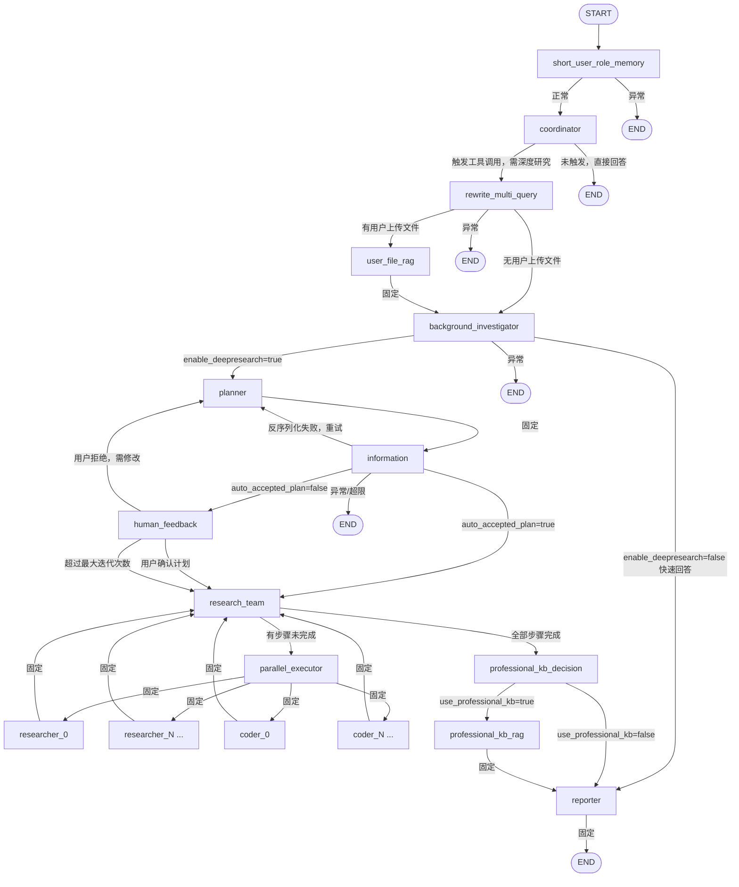

# DeepResearchConfiguration 图结构详解

`DeepResearchConfiguration` 是整个系统的图编排核心，用 Spring AI Alibaba Graph 将 AI 辅助研究流程组装为一张有向状态图（StateGraph）。

---

## 图结构流转图



---

## 节点详解

### 1. `short_user_role_memory` — 用户角色短期记忆

**类**：`ShortUserRoleMemoryNode`

图的入口节点。在每次对话开始时，从历史记录中提取并更新用户的角色画像（职业背景、知识偏好等），供后续节点个性化处理。

---

#### 1.1 总体三步流程

```
用户提问
  │
  ▼
Step 1: buildHistoryUserMessages()
  读取本 session 最近 N 轮历史问题（默认10轮）
  保存本轮问题到 user-query 存储
  │
  ▼
Step 2: extractShortTermMemory()
  填充 shortmemory-extract.md 模板
  调用 shortMemoryAgent（LLM）
  解析为 ShortUserRoleExtractResult
  │
  ▼
Step 3: saveOrUpdateShortTermMemory()
  读取上次存储的画像 → 置信度比较 → 融合或保留
  写入 extract-result 存储
  │
  ▼
根据 guideScope 决定是否将画像写入 State["short_user_role_memory"]
```

---

#### 1.2 Step 1 — 构建历史用户消息

**代码**：`ShortUserRoleMemoryNode#buildHistoryUserMessages()`

`ShortTermMemoryRepository` 维护两套独立存储，均以 `sessionId` 为键：

| 存储 | 写入时机 | 读取时机 |
|------|---------|---------|
| **user-query 存储** | 每轮开始时，`saveUserQuery()` 把当前问题连带 `create_time` 保存 | `getRecentUserQueries(sessionId, N)` 取最近 N 条 |
| **extract-result 存储** | Step 3 融合完成后，`saveOrUpdate()` 以 `SystemMessage` 形式覆盖 | `findLatestExtractMessage()` 取最新一条，`findMessageTrack()` 取完整轨迹 |

执行顺序：**先读历史**，再把**本轮问题追加到存储**，保证本轮问题不会污染当前的提取输入。

如果是首轮对话（历史为空），直接保存本轮问题并返回空字符串，后续步骤会生成一个低置信度的初始画像。

历史消息格式化为：
```
第1轮, 用户消息: 什么是微服务架构？
第2轮, 用户消息: Spring Boot 如何实现高并发？
```

---

#### 1.3 Step 2 — LLM 提取结构化画像

**代码**：`ShortUserRoleMemoryNode#extractShortTermMemory()`

加载 `prompts/memory/short/shortmemory-extract.md`，填入三个占位符后作为 `SystemMessage` 发送给 `shortMemoryAgent`：

| 占位符 | 填入内容 |
|--------|---------|
| `{{ last_user_message }}` | 当前用户问题 |
| `{{ history_user_messages }}` | Step 1 格式化的历史消息 |
| `{{ locale }}` | 固定 `zh-CN` |

LLM 返回 JSON，通过 `BeanOutputConverter<ShortUserRoleExtractResult>` 反序列化为以下结构：

```java
ShortUserRoleExtractResult {
    conversationAnalysis: {
        confidenceScore: 0.0~1.0,  // 本轮提取的置信度
        interactionCount: int        // 当前会话交互次数
    },
    identifiedRole: {
        possibleIdentities: String[],       // 推断身份，如 "software_engineer"
        primaryCharacteristics: String[],   // 特征标签，如 "architecture_focused"
        evidenceSummary: String[],          // 判断依据摘要
        confidenceLevel: LOW|MEDIUM|MEDIUM_HIGH|HIGH
    },
    communicationPreferences: {
        detailLevel: CONCISE|BALANCE|COMPREHENSIVE,
        contentDepth: OVERVIEW|PRACTICAL|CONCEPTUAL,
        responseFormat: CONCISE|DETAILED|STRUCTURED_WITH_EXAMPLES
    },
    userOverview: String  // 一句话用户概述，被下游节点直接注入提示词
}
```

反序列化后，`fillResult()` 补充填写 `userId`、`userQuery`、`conversationId`、`creatTime`（这些字段 LLM 不需要生成）。

---

#### 1.4 Step 3 — 置信度比较与融合

**代码**：`ShortUserRoleMemoryNode#saveOrUpdateShortTermMemory()`

读取 `extract-result` 存储中上一次的 `ShortUserRoleExtractResult`，对比 `conversationAnalysis.confidenceScore`：

```
当前置信度 >= 历史置信度?
├─ 是 → mergeAndUpdateShortTermMemory()
│        加载 shortmemory-update.md（含历史轨迹）
│        再次调用 LLM 融合两份画像
│        保存融合结果，写入 State
│
└─ 否 → 历史画像更可靠，仅将 interactionCount+1、updateTime 刷新后保存
         State 中写入的是"当前轮"的提取结果（保持对用户最新意图的指令跟随）
```

**融合逻辑（`shortmemory-update.md`）**：LLM 收到"当前提取"、"上次画像"和"历史轨迹"三个对象，判断当前提取与上次画像的宏观相似度是否超过 `updateSimilarityThreshold`（默认 0.8）：
- **相似**：合并特征列表，提高置信度（如 "student" + "high school student" → 保留更精确的 "high school student"）。
- **差异过大**（如职业型用户突然提了一个家庭问题）：参考历史轨迹，若偏离历史主线，保持上次画像不变（NONE CHANGE），视为角色扮演或偶发行为。

---

#### 1.5 画像注入下游节点（GuideScope）

节点最终能否把画像写入 State 取决于配置中的 `guideScope`：

| GuideScope | 行为 |
|------------|------|
| `EVERY`（默认）| 每轮都将融合后的 JSON 画像写入 `State["short_user_role_memory"]` |
| `ONCE` | 仅在首轮（无历史消息）写入画像；后续轮次写入空字符串，相当于关闭注入 |
| `NONE` | 始终不写入画像，后续节点无法读取 |

**下游节点消费**：`CoordinatorNode`、`PlannerNode`、`BackgroundInvestigationNode`、`ResearcherNode`、`ReporterNode` 均调用：

```java
// TemplateUtil.addShortUserRoleMemory()
String shortUserRoleMemory = state.value("short_user_role_memory", "");
if (StringUtils.hasText(shortUserRoleMemory)) {
    ShortUserRoleExtractResult result = JsonUtil.fromJson(...);
    messages.add(new SystemMessage(
        "You are having a conversation with " + result.getUserOverview()));
}
```

即将 `userOverview` 拼成 `"You are having a conversation with <一句话用户概述>"` 注入系统提示，引导 LLM 按用户背景调整回答的技术深度和表达方式。

---

#### 1.6 具体示例

**场景 A：程序员问架构问题（首轮）**

输入：`"Spring Boot 电商系统如何解决高并发？"`，无历史。

LLM 提取结果：
```json
{
  "conversationAnalysis": { "confidenceScore": 0.80, "interactionCount": 1 },
  "identifiedRole": {
    "possibleIdentities": ["software_engineer", "system_architect"],
    "primaryCharacteristics": ["technical_detailed", "architecture_focused"],
    "evidenceSummary": ["询问了 Spring Boot 电商系统的高并发解决方案，显示技术深度"],
    "confidenceLevel": "HIGH"
  },
  "communicationPreferences": {
    "detailLevel": "COMPREHENSIVE",
    "contentDepth": "PRACTICAL",
    "responseFormat": "STRUCTURED_WITH_EXAMPLES"
  },
  "userOverview": "一名软件工程师或系统架构师，偏好结构化、附带示例的全面实践性解答"
}
```
下游节点收到系统提示：`"You are having a conversation with 一名软件工程师或系统架构师，偏好结构化、附带示例的全面实践性解答"`

---

**场景 B：学生问基础概念（首轮）**

输入：`"什么是二叉树？"`，无历史。

LLM 提取结果：
```json
{
  "conversationAnalysis": { "confidenceScore": 0.60, "interactionCount": 1 },
  "identifiedRole": {
    "possibleIdentities": ["学生", "初级程序员"],
    "primaryCharacteristics": ["新手", "好奇的"],
    "evidenceSummary": ["问了一个关于二叉树的基本问题"],
    "confidenceLevel": "MEDIUM"
  },
  "communicationPreferences": {
    "detailLevel": "CONCISE",
    "contentDepth": "OVERVIEW",
    "responseFormat": "CONCISE"
  },
  "userOverview": "对基本概念感到好奇的学生或初级程序员，更喜欢简明扼要的概述"
}
```
下游节点收到系统提示：`"You are having a conversation with 对基本概念感到好奇的学生或初级程序员，更喜欢简明扼要的概述"`

相比场景 A，Reporter 生成的研究报告会更偏向基础解释而非深层原理。

---

**场景 C：第二轮问题，置信度上升，执行融合**

第一轮（`confidenceScore=0.75`，画像：`software_engineer`）之后，第二轮用户继续问 `"微服务间如何做服务发现？"`（`confidenceScore=0.80`）。

由于 `0.80 >= 0.75`，进入融合逻辑。LLM 判断两次画像相似度超过 0.8，合并 `evidenceSummary`，将 `confidenceLevel` 从 `MEDIUM_HIGH` 提升至 `HIGH`，并更新 `userOverview`。

---

**场景 D：工程师偶尔问了一个家庭食谱问题，置信度下降**

前三轮均为技术问题（`confidenceScore=0.75`），第四轮突然问 `"给孩子做什么菜好？"`（`confidenceScore=0.85`，但画像偏离为 `parent/recipe_seeker`）。

由于 `0.85 >= 0.75`，进入融合逻辑。LLM 对比历史轨迹，发现历史三轮都是技术画像，本轮偏离主线，判定为偶发行为，选择 NONE CHANGE，保持工程师画像不变，仅刷新 `interactionCount`。当前轮 State 写入当前提取结果以跟随最新指令，但存储中的长期画像不受影响。

---

**输出 key**：`short_user_role_next_node` → `coordinator`（异常时也路由到 `coordinator`，不中断图流程）

---

### 2. `coordinator` — 协调者

**类**：`CoordinatorNode`

判断用户意图，决定是直接简单回答还是触发完整的深度研究流程。

**核心逻辑**：
- 组装消息：角色记忆 + 会话历史 + 系统提示（`coordinator.md`） + 用户问题。
- 调用 `coordinatorAgent` 发起 LLM 调用。
- **关键判断**：检查响应是否触发了工具调用（`handoff_to_planner` 工具）：
  - 触发 → 需深度研究，`nextStep = "rewrite_multi_query"`
  - 未触发 → 直接回答，写入 `output`，`nextStep = END`
- 若启用短期记忆，将本轮对话写入 `MessageWindowChatMemory`。

**输出 key**：`coordinator_next_node` → `rewrite_multi_query` 或 `END`

---

### 3. `rewrite_multi_query` — 查询重写与多查询扩展

**类**：`RewriteAndMultiQueryNode`

对原始问题进行语义优化，扩展为多个搜索子查询，提升后续搜索效果。

**核心逻辑**：
1. **对话压缩**：若存在历史消息，用 `CompressionQueryTransformer` 消解指代，让查询自洽。
2. **查询重写**：用 `RewriteQueryTransformer` 让问题更适合搜索引擎。
3. **多查询扩展**：用 `MultiQueryExpander` 从不同角度生成 1~5 个子查询（数量由 `optimize_query_num` 控制）。
4. 将所有查询写入 `optimize_queries`。
5. 分支：若用户上传了文件（`user_upload_file=true`）→ `user_file_rag`；否则 → `background_investigator`。

**输出 key**：`rewrite_multi_query_next_node` → `user_file_rag` 或 `background_investigator`

---

### 4. `user_file_rag` — 用户文件 RAG 检索

**类**：`RagNode`（由 `RagNodeService.createUserFileRagNode()` 创建）

从用户上传的文件向量库中检索相关片段，作为补充上下文传入后续节点。

**核心逻辑**：
- 使用 `HybridRagProcessor` 执行混合检索（语义 + 关键词）。
- 检索结果拼接为上下文，通过 `ragAgent` 流式生成增强回答。
- 结果写入 `rag_content`，供 Planner 使用。

**输出**：固定边 → `background_investigator`

---

### 5. `background_investigator` — 背景调查员

**类**：`BackgroundInvestigationNode`

对每个优化查询执行网络搜索，并由 LLM 对搜索结果进行总结，生成背景调查报告。

**核心逻辑**：
- 遍历所有优化查询（`optimize_queries`）：
  - 通过 `SmartAgentSelectionHelperService` 智能选择搜索平台（Tavily、Jina、SerpAPI、阿里云 AI 搜索等）。
  - 调用 `SearchInfoService.searchInfo()` 执行搜索，获取标题/内容/URL/权重。
- 原始搜索结果存入 `site_information`。
- 对每个查询的结果 + 历史会话报告，调用 `backgroundAgent` 生成背景摘要。
- 分支：`enable_deepresearch=true` → `planner`；否则 → `reporter`（快速模式）。

**输出 key**：`background_investigation_next_node` → `planner` 或 `reporter`

---

### 6. `planner` — 研究规划者

**类**：`PlannerNode`

基于背景调查结果，制定结构化的研究计划，将复杂问题分解为具体执行步骤。

**核心逻辑**：
- 组装消息：角色记忆 + `planner.md` 系统提示 + 优化查询 + 背景调查结果 + 用户反馈 + RAG 内容。
- 调用 `plannerAgent` **流式**输出研究计划（JSON 格式，`Plan` 结构：`title`、`thought`、`steps[]`）。
- 每个 Step 包含：`title`（标题）、`description`（描述）、`stepType`（`RESEARCH` 或 `PROCESSING`）。
- 将 LLM 原始输出存入 `planner_content`，由下游 `information` 节点反序列化。

**输出**：固定边 → `information`

---

### 7. `information` — 计划解析与路由

**类**：`InformationNode`

轻量的反序列化节点，将 Planner 的 JSON 文本解析为 `Plan` 对象，并决定下一步走向。

**核心逻辑**：
- 用 `BeanOutputConverter` 将 `planner_content` 反序列化为 `Plan`。
- **反序列化失败**：未超限则递增 `plan_iterations` 并重回 `planner`；超限则 → `END`。
- **反序列化成功**：
  - `auto_accepted_plan=false` → `human_feedback`（等用户审核）
  - `auto_accepted_plan=true` → `research_team`（直接执行）
- 将 `Plan` 对象写入 `current_plan`。

**输出 key**：`information_next_node` → `human_feedback` | `research_team` | `planner` | `END`

---

### 8. `human_feedback` — 人工反馈中断点

**类**：`HumanFeedbackNode`

图的中断点（Interrupt）。暂停执行，等待前端用户审核研究计划，支持修改意见输入。

**核心逻辑**：
- 若 `plan_iterations >= plan_max_iterations`：强制进入 `research_team`，不再等待。
- 递增 `plan_iterations`。
- 读取 `state.humanFeedback().data()`：
  - `feedback=true`（用户确认）→ `research_team`
  - `feedback=false`（用户拒绝）→ 将 `feedback_content` 写入 State，跳回 `planner` 重新规划。
- 调用 `state.withoutResume()` 标记中断已消费。

**输出 key**：`human_next_node` → `planner` | `research_team`

---

### 9. `research_team` — 研究团队调度中心

**类**：`ResearchTeamNode`

检查计划执行进度的聚合节点，决定是继续分发任务还是进入报告生成。所有 `researcher_N`/`coder_N` 完成后都汇聚此节点。

**核心逻辑**：
- 检查 `current_plan` 中所有 Step 的 `executionStatus`：
  - 存在未完成步骤（非 `completed_`/`error_` 前缀）→ `parallel_executor`
  - 全部完成 → `professional_kb_decision`

**输出 key**：`research_team_next_node` → `parallel_executor` | `professional_kb_decision`

---

### 10. `parallel_executor` — 并行任务分发器

**类**：`ParallelExecutorNode`

将研究计划中待执行的步骤分配给对应的并行 Researcher/Coder 节点。

**核心逻辑**：
- 遍历所有无 `executionRes` 且无 `executionStatus` 的步骤：
  - `RESEARCH` 类型 → 以轮询方式分配给 `researcher_0..N`（写入 `assigned_researcher_N`）。
  - `PROCESSING` 类型 → 等所有 RESEARCH 步骤完成后，分配给 `coder_0..N`。
- 通过 `step.executionStatus = "assigned_researcher_N/coder_N"` 标记归属，不产出新 State key。

**输出**：固定边 → 各 `researcher_N` 和 `coder_N`（并行扇出）

---

### 11. `researcher_N` — 并行研究员

**类**：`ResearcherNode`（按配置动态创建 N 个实例）

领取分配给自己的 RESEARCH 步骤，执行网络搜索 + LLM 分析，产出研究子报告。

**核心逻辑**：
1. 从 `current_plan` 找到 `executionStatus = assigned_researcher_<自身ID>` 的步骤。
2. 若开启反思机制（`ReflectionProcessor`），检查是否需基于上次结果修订。
3. 对步骤标题/描述执行搜索（`SearchInfoService`），获取实时网络内容。
4. 若开启 MCP，动态附加 MCP 工具回调。
5. 若开启智能 Agent 路由（`SmartAgentDispatcherService`），根据问题类型选择专业化 Agent。
6. 组装消息：角色记忆 + 任务描述 + 引用规范 + 搜索结果 → 调用 `researchAgent` 流式输出。
7. 结果写入 `researcher_content_N`，步骤状态标记为 `completed_researcher_N`。

**输出**：固定边 → `research_team`

---

### 12. `coder_N` — 并行代码生成员

**类**：`CoderNode`（按配置动态创建 N 个实例）

领取分配给自己的 PROCESSING 步骤，执行代码生成任务。必须在所有 RESEARCH 步骤完成后才会被分配。

**核心逻辑**：
1. 从 `current_plan` 找到 `executionStatus = assigned_coder_<自身ID>` 的步骤。
2. 若开启反思机制，注入反思历史供 LLM 参考改进。
3. 若开启 MCP，动态附加工具（代码执行等）。
4. 组装消息：任务标题 + 描述 + 语言/locale + 反思历史 → 调用 `coderAgent` 流式输出代码。
5. 结果写入 `coder_content_N`，步骤状态标记为 `completed_coder_N`。

**输出**：固定边 → `research_team`

---

### 13. `professional_kb_decision` — 专业知识库决策

**类**：`ProfessionalKbDecisionNode`

所有步骤执行完毕后，决定是否需要从企业私有专业知识库补充检索。

**核心逻辑**：
- 若专业知识库决策未开启 → 直接跳过（`use_professional_kb=false`）。
- 读取配置中已启用的知识库列表（按优先级排序）。
- 构建决策提示词：用户查询 + 各知识库名称/描述。
- 调用 LLM 判断匹配度，解析 `SELECTED: [kb_id1, ...]` 格式响应。
- 写入 `use_professional_kb` 和 `selected_knowledge_bases`。

**输出**（`ProfessionalKbDispatcher` 直接读 `use_professional_kb`）：
- `true` → `professional_kb_rag`
- `false` → `reporter`

---

### 14. `professional_kb_rag` — 专业知识库 RAG 检索

**类**：`RagNode`（由 `RagNodeService.createProfessionalKbRagNode()` 创建）

从企业私有向量知识库中检索与查询最相关的文档片段，作为报告的权威来源补充。

**核心逻辑**：
- 根据 `selected_knowledge_bases` 中选定的 KB ID，初始化对应向量存储检索器。
- 用 `HybridRagProcessor` 执行混合检索（稠密向量 + 稀疏关键词）并融合排序。
- 检索结果拼接为上下文，通过 `ragAgent` 流式生成增强回答。
- 将结果写入 `rag_content`，供 Reporter 使用。

**输出**：固定边 → `reporter`

---

### 15. `reporter` — 报告生成者

**类**：`ReporterNode`

图的最终处理节点。整合所有研究成果，生成完整的研究报告，并持久化保存。

**核心逻辑**：
- 收集所有上下文：
  - 用户角色记忆
  - 背景调查结果（`background_investigation_results`）
  - 计划标题与思路（`current_plan.title/thought`）
  - 所有 researcher/coder 节点输出（`researcher_content_N`、`coder_content_N`）
  - 专业知识库 RAG 结果（若使用）
- 调用 `reporterAgent` **流式**生成最终 Markdown 报告。
- 报告生成后：
  - 写入 `final_report` 状态字段。
  - 若启用短期记忆，将报告存入 `MessageWindowChatMemory`（助手消息）。
  - 通过 `SessionContextService` 持久化保存到会话历史（供下次对话背景调查使用）。

**输出**：固定边 → `END`

---

## 两种执行路径对比

| | 快速问答路径 | 深度研究路径 |
|---|---|---|
| **触发条件** | `coordinator` 未触发工具调用 | `coordinator` 触发 `handoff_to_planner` |
| **路径** | `coordinator` → `END` | 完整 15 节点流程 |
| **适合场景** | 简单问题，一句话可回答 | 需要调研、分析、报告的复杂问题 |
| **涉及搜索** | 否 | 是（背景调查 + 各研究步骤） |
| **是否规划** | 否 | 是（Planner 生成 Plan） |
| **是否并行** | 否 | 是（researcher/coder 并行执行） |

---

## 关键 State Keys 速查

| Key | 写入节点 | 含义 |
|-----|---------|------|
| `short_user_role_memory` | ShortUserRoleMemoryNode | 用户角色画像（JSON） |
| `optimize_queries` | RewriteAndMultiQueryNode | 重写+扩展后的查询列表 |
| `site_information` | BackgroundInvestigationNode, ResearcherNode | 搜索原始结果 |
| `background_investigation_results` | BackgroundInvestigationNode | 背景调查摘要列表 |
| `planner_content` | PlannerNode | Planner LLM 原始输出（JSON 字符串） |
| `current_plan` | InformationNode | 解析后的 Plan 对象 |
| `plan_iterations` | InformationNode, HumanFeedbackNode | 当前规划迭代次数 |
| `feedback_content` | HumanFeedbackNode | 用户对计划的修改意见 |
| `researcher_content_N` | ResearcherNode | 研究员 N 的研究输出 |
| `coder_content_N` | CoderNode | 代码员 N 的代码输出 |
| `use_professional_kb` | ProfessionalKbDecisionNode | 是否使用专业知识库 |
| `selected_knowledge_bases` | ProfessionalKbDecisionNode | 选定的 KB ID 列表 |
| `rag_content` | RagNode | RAG 检索增强生成内容 |
| `final_report` | ReporterNode | 最终研究报告 |
| `output` | CoordinatorNode | 简单问题的直接回答 |

---

## 并行节点数量配置

`researcher_N` 和 `coder_N` 的数量由 `application.yml` 中的配置动态决定，不是硬编码：

```yaml
spring.ai.alibaba.deepresearch:
  parallel-node-count:
    researcher: 2   # 启动 researcher_0, researcher_1
    coder: 1        # 启动 coder_0
```

`DeepResearchConfiguration` 在启动时根据这个配置循环创建节点并连接边，形成"配置驱动的并行拓扑"。

---

## 可选功能开关

| 功能 | 配置项 | 影响的节点 |
|------|--------|-----------|
| 短期用户角色记忆 | `short-term-memory.enabled` | ShortUserRoleMemoryNode |
| 深度研究模式 | `enable_deepresearch`（运行时参数） | BackgroundInvestigationNode |
| 自动接受计划 | `auto_accepted_plan`（运行时参数） | InformationNode |
| 反思机制 | `reflection.enabled` | ResearcherNode, CoderNode |
| 智能 Agent 路由 | `smart-agents.enabled` | ResearcherNode, BackgroundInvestigationNode |
| MCP 工具 | `mcp.enabled` | ResearcherNode, CoderNode |
| RAG 检索 | `rag.enabled` | user_file_rag, professional_kb_rag |
| 专业知识库决策 | `rag.professional-knowledge-bases.decision-enabled` | ProfessionalKbDecisionNode |
